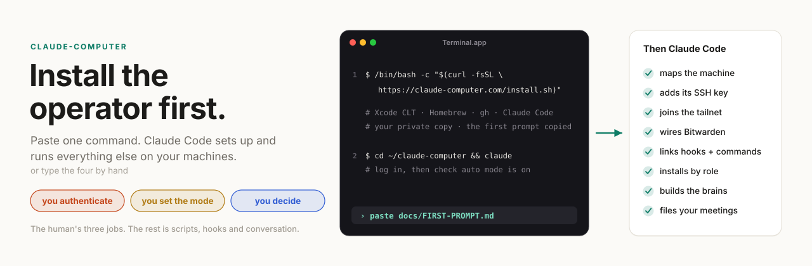
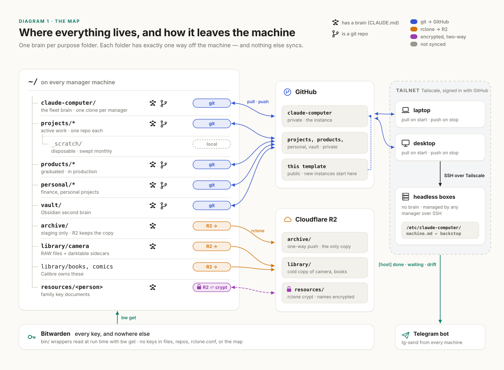
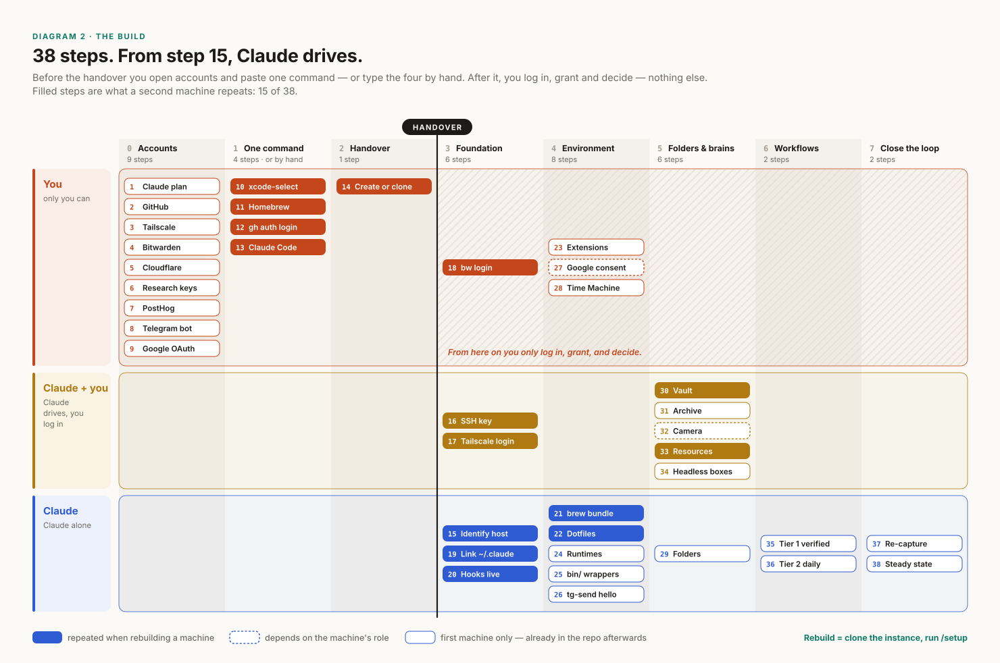
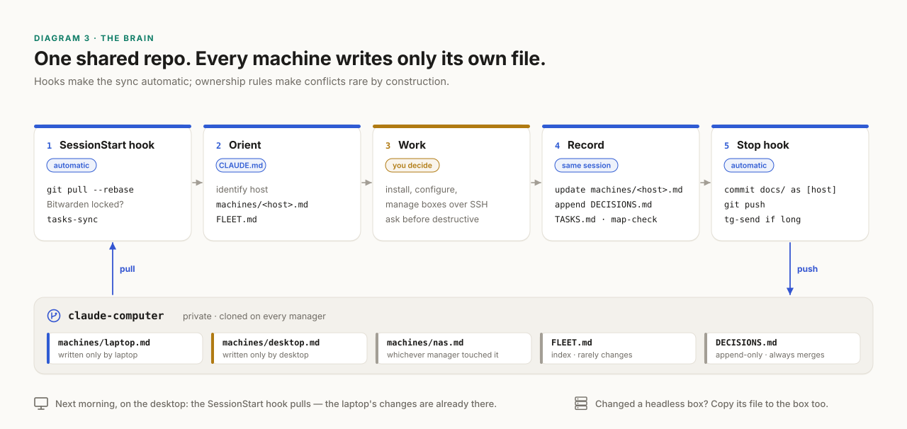
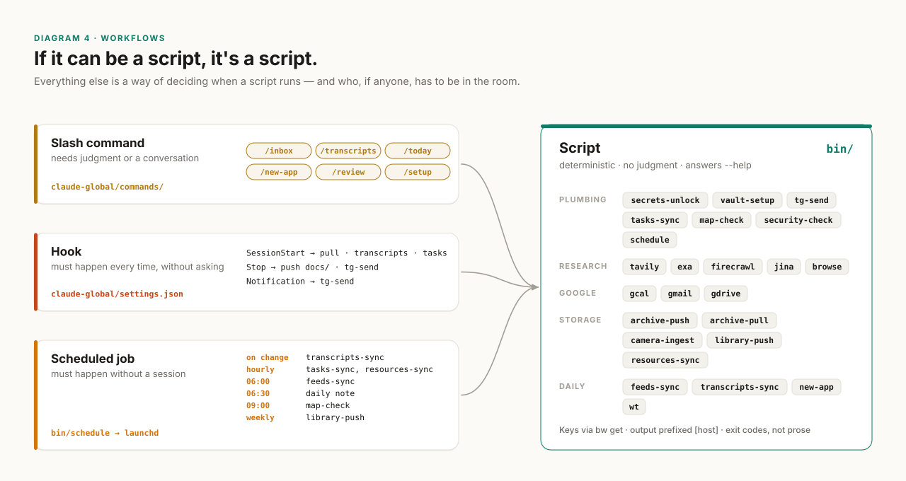

<picture>
  <source media="(prefers-color-scheme: dark)" srcset="docs/diagrams/hero-dark.svg">
  
</picture>

# claude-computer

by [Narendra Nag](https://narendranag.com)

_A Claude-first Mac setup for a solo developer._

[claude-computer.com](https://claude-computer.com) · [What's inside](https://claude-computer.com/whats-inside/) — everything it installs, the services, folders, scripts and process on one page.

A GitHub template that sets up a Mac for a solo developer. It assumes you have a Claude Max subscription and like terminal-first development in Claude Code — you step in for the key decisions, judgement and taste. Mac + Claude is the best combination IMO. The point is to get things done FAST, by cutting the time you spend on cruft.

It's part stack (Claude + Tailscale + GitHub + Bitwarden + Cloudflare + Homebrew), part organization (an opinionated take on folders and repos), part process (slash commands, hooks, scheduled jobs) — all designed to take advantage of the Mac + Claude combination.

I built this after spending a year arriving at a stack, pattern and process that has let me up my output exponentially. It is opinionated and reflects my learnings, taste and judgement. Change what doesn't fit. This repo is two things at once: the note that explains the approach, and the skeleton you clone to adopt it.

## Quick start

You need a Mac on a recent macOS — recent enough that Homebrew still supports it, which in practice means one of the last three releases — a GitHub account, and a Claude Max subscription. All-day sessions in auto mode are the whole point, and they outrun anything smaller. Apple silicon or Intel both work; the only thing gated on the chip is the MacParakeet cask (Apple silicon, macOS 14+), which the Brewfile skips on Intel, taking the dictation and transcript pipeline with it. Everything else can be added as you go — the [full checklist](#get-started) lists the accounts worth opening first.

1. **Install the operator** — one line in stock Terminal.app:

   ```bash
   /bin/bash -c "$(curl -fsSL https://claude-computer.com/install.sh)"
   ```

   It installs Xcode's Command Line Tools, Homebrew, `gh` and Claude Code, skipping whatever you already have; creates your private copy of this template at `~/claude-computer`; and puts the first prompt on your clipboard. **You type every password and do every login** — it never reads, writes or asks for a credential.

   Read it before you run it — it is a shell script from the internet, and the whole premise here is that you stay the one who decides:

   ```bash
   curl -fsSL https://claude-computer.com/install.sh | less
   ```

   And see exactly what it would do, changing nothing:

   ```bash
   /bin/bash -c "$(curl -fsSL https://claude-computer.com/install.sh)" -- --dry-run
   ```

   [`docs/INSTALL.md`](docs/INSTALL.md) has the flags, the exit codes and the same install by hand — the four commands in [The build](#the-build), then one `gh repo create`.

2. **Hand over** — open Claude Code in your copy:

   ```bash
   cd ~/claude-computer && claude
   ```

   Log in, check the status line reads **⏵⏵ auto mode on**, and paste the first prompt — it is already on your clipboard, and it is also [`docs/FIRST-PROMPT.md`](docs/FIRST-PROMPT.md). From there you log in, grant permissions and decide; Claude does the rest.

**A template for getting Claude to run a fleet of machines you own, be your developer, your personal assistant and more.**

> [!NOTE]
> Where I chose, the reason is in [`docs/TEMPLATE-DECISIONS.md`](docs/TEMPLATE-DECISIONS.md). Record what you change, and why, in your own instance's `docs/DECISIONS.md`.

**Contents** · [Quick start](#quick-start) · [The idea](#the-idea) · [The map](#the-map) · [The build](#the-build) · [The brain](#the-brain) · [Trust](#trust) · [Tools](#tools) · [The second brain](#the-second-brain) · [Workflows](#workflows) · [What I'd tell my past self](#what-id-tell-my-past-self) · [Get started](#get-started) · [Who's behind this](#whos-behind-this)

---

## The idea

The usual order is: set up the machine, install your tools, then maybe add an AI assistant to help you code. I do it the other way round. **The first thing on a new Mac is the operator.** Xcode's command line tools, Homebrew, the GitHub CLI and Claude Code — and then I hand it the machine.

All the things a solo dev ends up losing an afternoon to — install this, configure that, why is this port open, set up the new box in the cupboard, rotate this key — go to Claude instead. Not ordinary app use — system changes and bulk work.

The human keeps three jobs:

| Job              | What it means in practice                                                                                                                                            |
| ---------------- | -------------------------------------------------------------------------------------------------------------------------------------------------------------------- |
| **Authenticate** | Every login, every password typed, every OAuth consent screen, every "allow" on a macOS permission prompt. Claude never handles a credential.                        |
| **Set the mode** | Claude Code runs in _auto mode_: a separate classifier model reviews each action instead of you, and your ask and deny rules still hold. Never _bypass permissions_. |
| **Decide**       | Claude proposes; you choose. Anything destructive, anything touching credentials, anything that costs money — it asks first, every time.                             |

**Why "manage my machine" is a better first prompt than "help me code."** A coding assistant sees one repo. An operator sees the system the repos live in: which machine this is, what's installed, where secrets come from, how things sync, what runs on a schedule. Give it that context once, written down in files it maintains, and every later session — including every coding session — starts from a true picture instead of a guess. The machine setup is the context-engineering problem, solved once.

## The map

<picture>
  <source media="(prefers-color-scheme: dark)" srcset="docs/diagrams/map-dark.svg">
  
</picture>

The home directory gets a handful of top-level folders that sit beside the macOS defaults, not instead of them:

```text
~/
  claude-computer/     the fleet brain — repo
  projects/           active work — one repo per project (+ _scratch/, disposable)
  products/           projects that graduated to production — one repo each
  personal/           finance, personal projects — one repo each
  vault/              Obsidian second brain — repo
  archive/            cold storage staging — pushed to object storage, then removed
  library/            camera (RAW workflow), books and comics (Calibre)
  resources/<person>/ family key documents — encrypted two-way sync
```

**Top-level folders are containers, not repos** (except `claude-computer` and `vault`). Repos live one level down. Nothing is ever nested.

**The brain-per-folder rule.** Any folder that needs automation gets its own `CLAUDE.md` — a _brain_ — and a `TASKS.md`. You start Claude in the folder where the work is; that brain says what to do _here_, and points to `~/claude-computer/docs/` for what the system looks like. `archive/` has a brain whose two jobs are archive and retrieve. `library/camera` has one that ingests cards and finds photos by metadata. `resources/` has one that OCRs scans and tracks passport expiry dates. Folders that just hold files have no brain.

**Everything has exactly one way off the machine:**

| What                                     | Mechanism                                     | Why                                                                                                                |
| ---------------------------------------- | --------------------------------------------- | ------------------------------------------------------------------------------------------------------------------ |
| Brains, code, the vault                  | git → GitHub                                  | versioned, mergeable, works everywhere                                                                             |
| Archive, camera cold copy, books         | `rclone` → Cloudflare R2, one-way             | cheap object storage with no egress fees; the archive index is rebuilt from the bucket, so there's nothing to sync |
| Family documents                         | `rclone bisync` over an `rclone crypt` remote | two-way, and passport scans never sit in plain object storage                                                      |
| A working folder between my own machines | Syncthing                                     | peer-to-peer, no cloud                                                                                             |
| A file for someone else                  | Google Drive, or an R2 presigned link         | sharing is a separate job from syncing                                                                             |

**Why no Dropbox.** Every job it would do is covered above, and a second sync engine brings its own conflict rules, its own selective-sync state and its own idea of what "deleted" means. Same for iCloud Drive on working folders. The one real gap is arbitrary files on a phone; I accept that the phone gets the vault, not the filesystem.

## The build

<picture>
  <source media="(prefers-color-scheme: dark)" srcset="docs/diagrams/build-dark.svg">
  
</picture>

Thirty-eight steps in eight phases. The shape matters more than the count: **everything before step 14 is yours, and after it you only log in.**

**Phase 0 — Accounts** (browser, before you touch the machine). Claude Max subscription, GitHub, Tailscale (sign in with GitHub), Bitwarden, Cloudflare with a spend alert, keys for the research services, PostHog, and a Telegram bot. Accounts come first because every later step that needs a login stalls without one — and Bitwarden comes fourth so no key is ever written anywhere else.

**Phase 1 — One command**, or these four in stock Terminal.app — the by-hand path, and what [`install.sh`](install.sh) runs for you, checking each one first (see the [Quick start](#quick-start)):

```bash
xcode-select --install
/bin/bash -c "$(curl -fsSL https://raw.githubusercontent.com/Homebrew/install/HEAD/install.sh)"
brew install gh && gh auth login
brew install --cask claude-code && claude
```

Log in, and check the status line reads **⏵⏵ auto mode on** before the first prompt (Shift+Tab cycles modes). (Anthropic also ships a native installer, `curl -fsSL https://claude.ai/install.sh | bash`, which updates itself. I install through Homebrew so Claude Code lives in the Brewfile like everything else; the daily `brew autoupdate` agent keeps it current.)

> [!IMPORTANT]
> This template sets `"defaultMode": "auto"` in [`claude-global/settings.json`](claude-global/settings.json), which `/setup` links to `~/.claude/settings.json` — the user-level file, the only place outside managed settings where `auto` takes effect. It is also the built-in starting mode on Pro and Max; where auto mode isn't available for your account or model, sessions start in Manual and the same ask and deny rules apply. Auto mode reduces prompts; it does not guarantee safety. The ask list, the deny list, Time Machine and your own review of anything sensitive are what make it sane.

**Phase 2 — The handover.** Your last solo act:

```bash
cd ~ && gh repo create claude-computer --template narendranag/claude-computer --private --clone
cd ~/claude-computer && claude
```

Then paste the prompt from [`docs/FIRST-PROMPT.md`](docs/FIRST-PROMPT.md):

```text
You are the operator for this computer, my network and the devices on it. Your
brain is this repo: read CLAUDE.md now and follow it.

Start with this computer. This is a new machine, so run /setup:

1. Identify this machine (hostname, hardware, macOS version) and ask me its role
   (client, build, server) and a one-line purpose. Write
   docs/machines/<host>.md from docs/machines/_example.md, add it to
   docs/FLEET.md, and append the decision to docs/DECISIONS.md.
2. Create an SSH key for this machine only, add it to GitHub with gh, and push
   this repo.
3. Install Tailscale and walk me through logging in. Record the
   Tailscale name in the map.
4. Install the Bitwarden CLI and walk me through `bw login`. Confirm
   bin/secrets-unlock works.
5. Link claude-global/ into ~/.claude so the hooks and commands are live.
6. Install the Brewfile layers for this role, link dotfiles, run
   macos-defaults.sh. Tell me before each step that needs a password or a
   macOS permission prompt.
7. Run bin/map-check and bin/security-check, fix what fails, and update the map.

Rules for the whole session: ask before anything destructive, anything that
touches credentials, and anything that costs money. I will do every login and
every step that handles a password myself. Record every decision we make in
docs/DECISIONS.md. When something is deferred, put it in TASKS.md under Later.
At the end, commit and push docs/ and tell me what is left.
```

**Phases 3–7 — Claude drives.** Foundation (map the host, SSH key, tailnet, Bitwarden, link `~/.claude` so hooks are live), environment (Brewfiles by role, dotfiles, macOS defaults, runtimes, Playwright, the `bin/` wrappers, a first `tg-send`), folders and brains, workflows, and a closing pass that re-captures the Brewfiles from what's actually installed. The order is deliberate: hooks go live before anything assumes sync; Time Machine and the security baseline land before folders fill with data; brains are created only after the tools they call exist.

`/setup` covers foundation, environment and protection; it ends by queueing folders, brains and workflows in `TASKS.md` as the next jobs, so each gets its own conversation.

**A second machine is the fifteen filled steps in the diagram**, not thirty-eight: the four commands, `gh repo clone <you>/claude-computer ~/claude-computer` instead of creating from the template, then `/setup` — which reads the repo, finds everything already decided, and asks only what's specific to this machine.

## The brain

<picture>
  <source media="(prefers-color-scheme: dark)" srcset="docs/diagrams/loop-dark.svg">
  
</picture>

`~/claude-computer` is a private repo created from this template, cloned on every machine that runs Claude Code. Four files carry the weight:

| File                      | Holds                                                | Rule                                                                                                         |
| ------------------------- | ---------------------------------------------------- | ------------------------------------------------------------------------------------------------------------ |
| `CLAUDE.md`               | operating instructions                               | identify the host → read its machine file → read `FLEET.md`; pull before acting, push after changing `docs/` |
| `docs/machines/<host>.md` | this machine's state                                 | written only by that machine                                                                                 |
| `docs/FLEET.md`           | every machine, role, Tailscale name, Brewfile layers | changes rarely                                                                                               |
| `docs/DECISIONS.md`       | every decision, `[host] [date]` tagged               | append-only, so it always merges                                                                             |

**What goes in the map.** Identity and role; Tailscale name; what's installed beyond the Brewfile layers; VS Code extensions; launchd jobs; listening ports; services; where keys live (never the keys); sensitive locations; the security baseline. Sections marked _(checked)_ are parsed by `bin/map-check`, which diffs them against reality — `brew leaves`, `code --list-extensions`, the LaunchAgents directories, `lsof` — and then runs `bin/security-check`. **Drift is a bug**: fix the machine or fix the map, in the same session.

**Per-machine files in one shared repo.** I started with "no shared map" — each machine keeps its own. It fell apart the first time one machine needed to manage another. Now the repo is shared and the _files_ are per machine: a laptop writes only `machines/laptop.md` plus the file of any headless box it changed. Conflicts are rare by construction, and when two managers touch the same box in overlapping sessions, the rebase surfaces it and Claude merges markdown well.

**Hooks do the syncing, not discipline.** The `SessionStart` hook pulls with `--rebase --autostash`, reports whether Bitwarden is unlocked, and refreshes task copies in the vault. The `Stop` hook commits any `docs/` change as `[host] update …` and pushes, at the end of every turn — because sessions get killed far more often than they get exited.

**The backstop on each box.** Headless boxes have no brain; a manager reaches them over SSH on the tailnet. After changing one, the manager also writes that box's file to `/etc/claude-computer/machine.md` on the box itself. If the repo is ever stale, or the box is reimaged, the box can still say what it is.

## Trust

Auto mode is only sane with guard rails. These are mine.

**Auto mode, never bypass.** A classifier model reviews every action before it runs and blocks anything that goes beyond what you asked for, reaches infrastructure it doesn't recognize, or looks steered by content Claude just read. Rules sit on top: in [`claude-global/settings.json`](claude-global/settings.json), `git push`, `rm`, `rclone`, `sudo` and the storage scripts are on the _ask_ list, which prompts even in auto mode; force-push, raw `bw get`, the Keychain item holding the Bitwarden session token, and reading browser profiles are on the _deny_ list, which blocks in every mode. Anything the classifier refuses three times in a row drops the session back to asking you. The lists raise the bar and remove whole categories of accident. They are not a sandbox — see below.

**One job runs unattended.** Everything else here assumes you are at the keyboard. The `daily-note` job in [`bin/schedule`](bin/schedule) is the exception: at 06:30 launchd runs `claude -p` with nobody to answer a prompt. So it is fenced in twice — its working directory is `~/vault`, which is the only tree it can edit, and `--allowedTools` limits it to `Read`, `Edit`, `Write`, `Glob`, `Grep` and `git status` / `add` / `commit`. Everything else is refused outright rather than queued for an approval that will never come. If you add a scheduled job that runs Claude, do the same, and say so in your `docs/DECISIONS.md`.

**One SSH key per machine.** Generated on the machine, registered on GitHub under the machine's name, never copied. Losing a laptop means revoking one key.

**Bitwarden is the only secret store.** API keys, bot tokens, R2 credentials, the crypt password, Google's OAuth client — all Bitwarden items, read at run time by the scripts in `bin/` through `bw get`. There is no `.env` with keys in any repo, no `rclone.conf` with credentials on disk (remotes are defined from environment variables for the life of one command), and no key on a command line (curl reads auth headers from stdin, so nothing shows in `ps`). You unlock once per login; the session token lives in the macOS Keychain so every script and hook shares it. [`docs/SECRETS.md`](docs/SECRETS.md) lists every item the scripts expect.

**The password-migration rule.** Moving from Apple Passwords, Chrome or 1Password into Bitwarden is a Claude-guided job where **you do every step that touches a credential**. You export; Claude runs `bw import`, confirms the item count, and securely deletes the export — without ever reading it. Then you turn off password saving everywhere else, so there is one store.

**Browser profiles are credentials too.** Headless browsing uses Playwright's own Chromium through `bin/browse`, and its persistent profiles hold logged-in sessions. They live in `~/.config/browse/profiles/`, mode 700, are listed as a sensitive location in every machine file, are unreadable by Claude in settings, and `security-check` fails if they're ever inside a git work tree.

**Time Machine is the net.** Auto mode on a machine you care about needs a whole-machine rollback. Pick a target during setup — an external disk or a box on the tailnet — and record it in the map.

**A pre-commit secret scan everywhere.** `gitleaks` runs on every commit in this repo, in your instance, and in every project `new-app` scaffolds. It's the backstop, not the plan.

**What this does not protect against.** Worth being plain about, because the list above can read as stronger than it is. The ask and deny rules are pattern matches on command strings, not a sandbox: they stop the obvious spelling of a thing, not every spelling of it, and a command that reaches the same place by another route — a script, an alias, an interpreter — goes through. The Bitwarden session token sits in the login Keychain precisely so that every script and hook can read it, which means any process you run can read it too; denying Claude the `security` command that fetches it is a speed bump, not a boundary. The `Stop` hook commits and pushes `docs/` at the end of every turn, so whatever went into the map during a turn you didn't fully read is already on GitHub. And the one scheduled job above runs Claude with no one watching. None of this is an argument against the setup — it is an argument for the two things that actually bound the damage: Time Machine, and reading what the map says changed.

## Tools

**Brewfiles in layers.** [`Brewfile`](Brewfile) is every machine: the tools the setup itself needs, the command-line tools Claude reaches for constantly (`ripgrep`, `fd`, `jq`, `bat`, `git-delta`…), one version manager (`mise`) with `uv` and `pnpm`, media tools including `exiftool` and `ocrmypdf`, and the apps. [`Brewfile.dev`](Brewfile.dev) adds build-machine things (OrbStack, darktable, Calibre, `wrangler`, Xcode through `mas`). [`Brewfile.server`](Brewfile.server) is for headless Macs. What Homebrew can't install — oh-my-zsh, runtimes, Playwright and its Chromium, VS Code extensions, the daily upgrade agent — is [`setup-tools.sh`](setup-tools.sh). Packages keep themselves current through the `domt4/autoupdate` tap: `brew autoupdate start 86400 --upgrade --cleanup` (current Homebrew asks you to `brew trust` the tap's command first; `setup-tools.sh` does both).

**CLI first, MCP last.** An MCP server loads its full tool schemas into every session's context. Five research servers can cost thousands of tokens before you've typed anything, in every session, forever. So each service gets a thin wrapper in `bin/` instead — `tavily "query"`, `exa "query"`, `firecrawl <url>`, `jina <url>`, `browse <url>`, `gcal`, `gmail`, `gdrive` — that reads its key from Bitwarden and prints markdown. The global `CLAUDE.md` lists them in one paragraph. Standing context cost: one paragraph. MCP is reserved for things that are stateful or OAuth-bound in a way a wrapper can't handle. It's more work up front and permanently cheaper.

**Headless browsing is Playwright, not Chrome.** `browse` drives Playwright's bundled Chromium: markdown by default, `--screenshot`, `--pdf`, and `--profile` for sites you've logged into yourself with `browse --login`. Google Chrome stays the human's browser. The same engine runs end-to-end tests in every web app the scaffold creates. It even rendered the screenshots I used to check the diagrams in this README.

**The terminal: Ghostty.** This whole approach is _configuration as files that Claude maintains_, and iTerm2 was the one tool in my stack whose configuration lived in a GUI. Ghostty's is a plain text file ([`dotfiles/ghostty.config`](dotfiles/ghostty.config)) the brain can own, and it's fast and native besides. If you depend on tmux control mode, triggers or session restore, stay on iTerm2 — those have no equivalent yet.

**LibreOffice as a build tool.** Nobody hand-edits a generated document. Projects produce `.docx`, `.xlsx` and `.pptx` from code and use `soffice --headless` to convert and check them.

**Two languages, four targets.** Python and TypeScript, nothing else unless a platform forces it. [`docs/DEV-GUIDELINES.md`](docs/DEV-GUIDELINES.md) fixes the rest: `uv` and `pnpm`, `ruff` and `biome`, `pytest`, `vitest` and Playwright, SQLite everywhere (a plain file, Cloudflare D1, or Turso, whose free plan covers 100 databases and 5 GB), `better-auth`, PostHog for analytics, session replay, flags and errors (its free tier includes 1M events, 5K recordings and 100K exceptions a month) with self-hosted Bugsink — one Docker container, Sentry SDKs unmodified — as the private fallback.

| Target    | Stack                                                                             | Ships via                                    |
| --------- | --------------------------------------------------------------------------------- | -------------------------------------------- |
| Web       | Next.js + Tailwind + shadcn/ui; Hono on Workers for API-only; FastAPI when Python | Cloudflare, `wrangler`                       |
| Mobile    | Expo + Expo Router + NativeWind                                                   | EAS Build + Submit                           |
| CLI / TUI | Typer + Rich, Textual                                                             | `uv tool install`, PyPI or a brew tap        |
| Desktop   | Tauri v2 with a TypeScript front end                                              | signed, notarized `.dmg` from GitHub Actions |

`new-app <type> <name>` scaffolds any of them with a brain, a task list, a `justfile`, the secret scan and a private GitHub repo.

## The second brain

**PARA was designed for a human doing the filing.** With Claude doing it, the constraint flips: capture should cost nothing, and filing, linking and retrieval are Claude's job. So the vault optimises for cheap capture and for Claude finding and connecting things — not for where a person would browse.

```text
vault/
  inbox/       everything lands here — dictation, web clips, quick notes
  daily/       one note per day, drafted from tasks
  notes/       flat. atomic ideas, meetings, decisions. no subfolders
  people/      one note per person who keeps coming up
  projects/    one hub note per brain
  sources/     articles, feed digests
    transcripts/   raw transcripts, once processed
  maps/        maps of content, all tasks, weekly reviews
  _templates/
```

**`vault-setup` makes the vault, plugins and all.** The `obsidian` cask is an empty app until something creates the vault and installs what the brain depends on, so [`bin/vault-setup`](bin/vault-setup) does both: `templates/vault/` into `~/vault` as a git repo with the secret scan, then Obsidian Git, Dataview and Templater — looked up by id in [Obsidian's own registry](https://github.com/obsidianmd/obsidian-releases) and taken from each repo's latest release. That is third-party code running with your notes open, so every source URL and version is printed as it is fetched and recorded in `.obsidian/plugins/VERSIONS.md`; the binaries stay out of the vault repo and `vault-setup` restores them on the next machine. Your Obsidian settings are never clobbered — the plugin list is merged, defaults are written only where no file exists. Two steps it cannot do for you, and prints instead: turning off restricted mode the first time Obsidian opens the vault, and installing the **Obsidian Web Clipper** browser extension, where one setting matters — save clips to `inbox/`.

**Properties over folders.** Every note carries `type`, `created`, `tags`, `status`, `people`, `project`, `source`, and Claude enforces the schema when it files. Structure lives in frontmatter, where Dataview can query it, instead of in a folder tree nobody maintains.

**Tasks live with their brain; the vault gets copies.** Every brain owns a `TASKS.md` with `Now / Next / Later / Done`. That file is the source of truth. `bin/tasks-sync` walks every brain and writes read-only copies into the vault: one `maps/tasks.md` with overdue items flagged, and a marker-delimited block in each project's hub note. Ticking a box in Obsidian changes nothing — you change a task by telling the brain that owns it. The rule that makes this safe: **generated and authored content never mix.** Scripts write only between markers or in notes marked `generated`; everything else is yours and no script overwrites it.

**The voice pipeline.** [MacParakeet](https://macparakeet.com) transcribes on the machine with NVIDIA's Parakeet model — nothing leaves the Mac. Three routes, by length:

| Capture                  | Route                                                                                                        | Script                                                                                                                                        |
| ------------------------ | ------------------------------------------------------------------------------------------------------------ | --------------------------------------------------------------------------------------------------------------------------------------------- |
| A thought, a to-do       | dictate into `inbox/quick.md`                                                                                | none — cheapest wins                                                                                                                          |
| A meeting                | record in MacParakeet                                                                                        | `transcripts-sync` exports each completed transcript to `inbox/transcripts/` — a launchd agent watches the app's database, so it just appears |
| A file, a URL, a podcast | `macparakeet-cli transcribe <input> --no-history --output-dir ~/vault/inbox/transcripts --format transcript` | none — `--no-history` keeps it out of the database, so nothing is exported twice                                                              |

`transcripts-sync` reads the database read-only past a per-machine cursor, and stamps every note with the recording's id, so a lost cursor can't duplicate anything and a transcript you've already processed is never overwritten. `/transcripts` then does the thinking: a five-line summary with decisions and open questions in `notes/`, people linked, **every action item routed to the brain that owns it** under `## Next` with a link back, and the raw transcript filed in `sources/transcripts/`. Action items nobody owns go to `## Unassigned` — which sits at the top of the task map, must be emptied by every weekly review, and while it holds more than ten pings Telegram once a day.

**The reading pipeline.** `bin/feeds-sync` runs every morning: RSS through `feedparser`, full text through Firecrawl for sites that only publish teasers, falling back to `browse` for pages that need a real browser, and newsletters pulled from Gmail — which is also the clean route for paywalled outlets, whose RSS carries only headlines. It writes one digest per day into `sources/feeds/`, and the daily note links to it. Clipping from the browser uses **Obsidian Web Clipper** pointed at `inbox/`. `/inbox` then files everything.

## Workflows

<picture>
  <source media="(prefers-color-scheme: dark)" srcset="docs/diagrams/forms-dark.svg">
  
</picture>

**Four forms, one rule: if it can be a script, it's a script.** A slash command is for when a step needs judgment or a conversation, and it orchestrates scripts rather than reimplementing them. A hook is for what must happen every time without asking. A scheduled job is for what must happen without a session, installed as a launchd agent by `bin/schedule`.

| Workflow            | Trigger             | Form                                                                   |
| ------------------- | ------------------- | ---------------------------------------------------------------------- |
| Session start / end | every session       | hooks → `git pull`, `tasks-sync` / commit + push `docs/`, `tg-send`    |
| New machine         | rare                | `/setup` → Brewfiles, `setup-tools.sh`, `map-check`                    |
| New project         | often               | `/new-app` → `bin/new-app`                                             |
| New vault           | once per machine    | `vault-setup` → the vault, its plugins, its Obsidian config            |
| Meeting transcripts | on recording        | `transcripts-sync` (watches the MacParakeet database) → `/transcripts` |
| Process inbox       | daily               | `/inbox` (transcripts first, then `quick.md`, then the rest)           |
| Daily note          | 06:30 + on demand   | scheduled draft + `/today`                                             |
| Reading digest      | 06:00               | `feeds-sync`                                                           |
| Fleet drift         | daily               | `map-check` → `tg-send` on drift                                       |
| Weekly review       | weekly              | `/review` — empties `## Unassigned` first                              |
| Archive / retrieve  | ad hoc              | `/archive`, `/retrieve` → `archive-push`, `archive-pull`               |
| Camera card         | when a card goes in | `camera-ingest`                                                        |
| Family documents    | hourly              | `resources-sync`                                                       |
| Graduate a project  | ad hoc              | `/graduate`                                                            |
| Upstream a lesson   | occasional          | `/upstream` → PR against this template                                 |
| Rotate a secret     | ad hoc              | `/rotate`                                                              |

**Build them in this order.** Plumbing first — unlock, notifications, the hooks, `tasks-sync`, `map-check` — because everything else assumes keys, sync and a trustworthy map. Then the daily loop, because you touch it every day. Then the per-trigger jobs, when their trigger first happens. `/setup` gets validated properly only when you build machine two.

## What I'd tell my past self

**1. Share the map, split the files.** I began with a rule that each machine keeps its own map and nothing is shared. It lasted until the first time the laptop needed to fix the Mac Studio. One shared repo with a file per machine, synced by hooks, gives every manager the whole fleet and almost never conflicts.

**2. Plaintext secrets in a private repo are still plaintext.** My first version had a `.secrets` repo — private, gitignored everywhere else, and a copy of every key on every clone forever. Moving to Bitwarden cost one unlock per session. That's the whole price.

**3. Don't port a filing system designed for humans.** PARA asked me to decide where a note belonged at the moment I had the least context to decide. With Claude filing, the right structure is an inbox, a flat notes folder, and properties — and the discipline moves from "file correctly" to "capture everything."

**4. MCP servers have a standing cost.** Every connected server's tool schemas ride along in every session whether you use them or not. A shell wrapper costs a line in `CLAUDE.md` and nothing until it runs. Measure before you connect.

**5. Put your terminal config in a file.** I stayed on iTerm2 for years out of muscle memory. The moment the machine's configuration became something Claude maintains, a GUI-only preferences pane became the one part of my setup it couldn't touch.

**6. Write the rule as a check, not a sentence.** "Keep the map current" in a `CLAUDE.md` is a hope. `map-check` failing is a fact. Every time a rule mattered enough to write down, it eventually became a script.

## Get started

**0. What you need.** A Mac on a recent macOS — recent enough for Homebrew, so one of the last three releases. Apple silicon or Intel: everything here works on both, except the MacParakeet cask (Apple silicon, macOS 14+), which the Brewfile skips on Intel; without it there is no dictation or transcript pipeline. Nothing in this repo needs a specific macOS version of its own.

**1. Phase 0 checklist** — in a browser, before touching the machine:

- [ ] A Claude Max subscription. All-day sessions in auto mode are the whole point, and they outrun anything smaller.
- [ ] GitHub account (use it as your login everywhere it's offered)
- [ ] Tailscale, signed in with GitHub
- [ ] Bitwarden — every key from here on goes straight into an item
- [ ] Cloudflare (R2, D1, Workers, DNS) — **set a spend alert**
- [ ] Research service keys: Tavily, Firecrawl, Jina, Exa → Bitwarden
- [ ] PostHog → Bitwarden, spend alert
- [ ] Telegram: `/newbot` with @BotFather → token and chat id → Bitwarden
- [ ] _Later:_ Google Cloud OAuth client for Gmail, Calendar and Drive ([how](docs/SECRETS.md#getting-each-value))

**2. Install the operator and create your instance** — one line in Terminal.app:

```bash
/bin/bash -c "$(curl -fsSL https://claude-computer.com/install.sh)"
```

It installs Xcode's Command Line Tools, Homebrew, `gh` and Claude Code, skipping what you already have, creates your private copy at `~/claude-computer`, and puts the first prompt on your clipboard. You type every password and do every login. Read it first with `curl -fsSL https://claude-computer.com/install.sh | less`, or see what it would do with `… -- --dry-run`. Flags and exit codes: [`docs/INSTALL.md`](docs/INSTALL.md).

By hand instead: the four commands in [The build](#the-build), then

```bash
cd ~ && gh repo create claude-computer --template narendranag/claude-computer --private --clone
```

Without `--template` (an older `gh`, or a mirror): `git clone https://github.com/narendranag/claude-computer.git ~/claude-computer`, then create an empty private repo of your own and point `origin` at it.

**3. Hand over:**

```bash
cd ~/claude-computer && claude
```

Paste [`docs/FIRST-PROMPT.md`](docs/FIRST-PROMPT.md) — the installer already put it on your clipboard. Then do what it asks: log in, grant, decide.

<details>
<summary><b>What's in the box</b></summary>

| Path                                                                                  | What                                                                                                 |
| ------------------------------------------------------------------------------------- | ---------------------------------------------------------------------------------------------------- |
| [`CLAUDE.md`](CLAUDE.md)                                                              | the fleet brain's operating instructions                                                             |
| [`install.sh`](install.sh)                                                            | the one-liner that puts the operator on a new Mac — [`docs/INSTALL.md`](docs/INSTALL.md) explains it |
| [`bin/`](bin)                                                                         | every script — each answers `--help` and uses exit codes                                             |
| [`lib/`](lib)                                                                         | the helpers and exit codes every script sources — `common.sh`, `cc.py`, `google_auth.py`             |
| [`claude-global/`](claude-global)                                                     | global `CLAUDE.md`, settings, hooks and slash commands, linked into `~/.claude`                      |
| [`Brewfile`](Brewfile) · [`.dev`](Brewfile.dev) · [`.server`](Brewfile.server)        | packages by role                                                                                     |
| [`setup-tools.sh`](setup-tools.sh) · [`vscode-extensions.txt`](vscode-extensions.txt) | what Homebrew can't install, and the VS Code extension list it reads                                 |
| [`dotfiles/`](dotfiles) · [`macos-defaults.sh`](macos-defaults.sh)                    | shell, prompt, Ghostty, git; macOS settings                                                          |
| [`templates/`](templates)                                                             | app scaffolds (web, mobile, cli, desktop) and brains (vault, archive, camera, resources)             |
| [`docs/`](docs)                                                                       | first prompt, dev guidelines, secrets, fleet index, decisions, the example machine file              |
| [`docs/diagrams/render.py`](docs/diagrams/render.py)                                  | source for every diagram in this README                                                              |
| [`tests/`](tests)                                                                     | what CI runs beyond shellcheck — `install-dry-run.sh` drives `install.sh --dry-run`                  |

</details>

**Contributing.** Mostly you shouldn't have to — fork it and make it yours. But if you have made something general work (another camera, Linux, a tool that does what Bitwarden or R2 does here), [`CONTRIBUTING.md`](CONTRIBUTING.md) says how. Security problems go through a private advisory, never a public issue: [`SECURITY.md`](SECURITY.md).

**Keeping up with the template.** Your instance keeps this repo as an `upstream` remote, fetch-only. Pull improvements when you choose. When you learn something worth sharing, `/upstream` rewrites it generically and opens a pull request here — never a push from your private instance.

## Who's behind this

I'm Narendra. Twenty-eight years at the intersection of journalism, digital and streaming, and I now run [Marain](https://marain.space), an operator's practice — most advisors leave a deck, I leave a system that runs. I write about media, attention and the industries that shape how we spend it at [narendranag.com](https://narendranag.com). For the last year I've spent 90% of my time in Claude Code and the terminal, with a laptop, a Mac Studio running Qwen, a Mac Mini, a Hetzner VPS (managed entirely by Claude) and a Pi — all set up and run by Claude. This template is that setup, written down.

I've spent the last year increasing how often, where, and how I use Claude. Today, I spend 90% of my time in Claude Code and in the terminal. I have a laptop as a daily driver, a private LLM (Qwen) running on a Mac Studio, a Mac Mini, a Hetzner VPS managed entirely by Claude, and a Pi as my media center — all set up, managed and run by Claude. I decided to codify my approach to infrastructure (GitHub + Cloudflare), work (terminal-first, CLI script over app/prompt, AI-native but not MCP-first), organization (folder structure matters), dev patterns (git-based, dev stack, free), productivity tools (MacParakeet, Obsidian), and more (photography, writing, etc.) and make it available to anyone. There are many hard-earned lessons here: I went down the path of naming Claude (Jeeves, in my case), getting it to hire sub-agents and similar YouTube-friendly productivity hacks almost a year ago. This is where I've landed — it's fast, it works, and it's Claude-first (sorry ChatGPT). And now, it's yours to do with as you please.

## Fork it for another agent

This is built for Claude Code, and it's staying that way — the hooks, the slash commands and the permission model are all Claude Code specifics, not a generic agent abstraction. But the ideas underneath aren't Claude-specific: an operator first, a map the machine keeps honest, one brain per folder, scripts over prose, hooks for the syncing so nothing depends on remembering. If you want this for Codex, Gemini CLI or a local model, fork it — it's MIT — and tell me so I can link it here.

---

MIT licensed. Built by a human who authenticated, set the mode and decided, and by Claude Code, which did the rest. claude-computer is an independent open-source project. It is not affiliated with, endorsed by or sponsored by Anthropic. Claude and Claude Code are trademarks of Anthropic, PBC.
